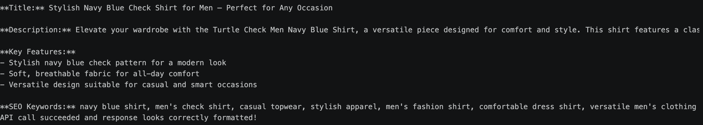
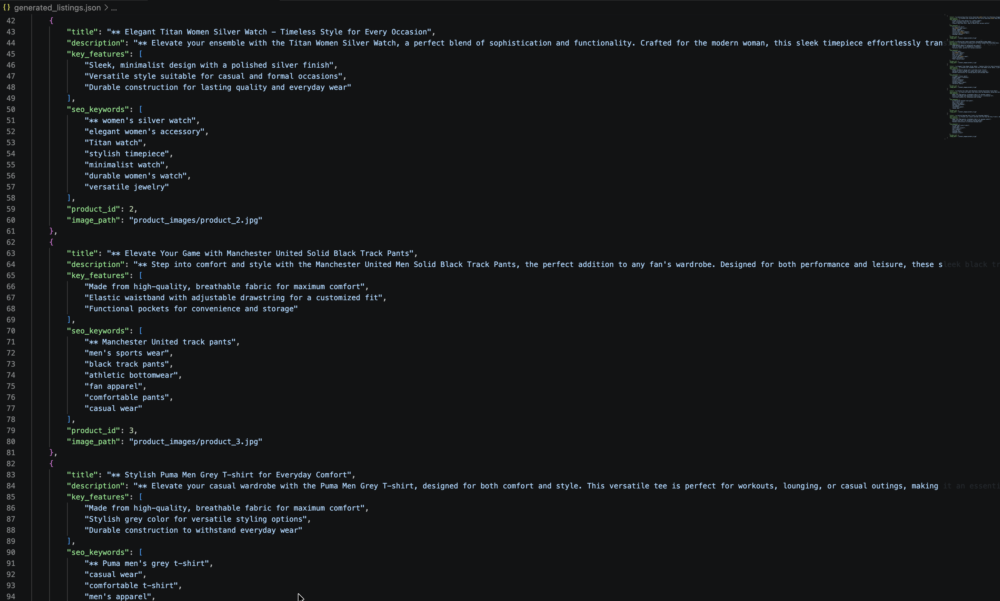

Screenshots or output showing:
Successful API calls - 
Generated listings for at least 3 products - 
Error handling examples - 

A brief report (1 page) including:
How the API integration works - The program sends base64-encoded product images along with a structured text prompt (name, category, color) to OpenAI's gpt-4o-mini vision model, which returns a formatted listing that gets parsed via regex into JSON. 

Challenges you faced - I was unable to load API key because I added the key in .env with incorrect key. Instead of OPENAI_* I used OPEN_* and because of this I lost almost 40 mins.

Quality of generated listings - Some of the listings were not formatted correctly. Some of the listings have to be cleaned up for direct usage on ecommerce website. 

Potential improvements - I need to improve my prompt to add a cleaning layer. I need to research on finding ways to clean data after reading them. 